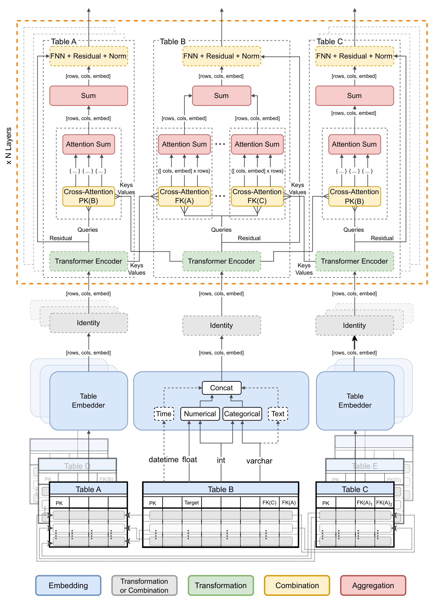

# Transformers Meet Relational Databases

The repository with the framework and experiments discussed in the article [Transformers Meet Relational Databases](https://arxiv.org)

#### _A study on integrating transformer architectures with relational databases via a modular message-passing framework, demonstrating enhanced performance._

## About

The end-to-end nature of the system allows for streamlined integration of deep learning methods in the relational database settings. The pipeline allows for attaching any relational database easily through a simple connection string (with [SQL Alchemy](https://www.sqlalchemy.org/)). Special care is given to databases of the [CTU Relational repository](https://relational.fel.cvut.cz/), which are currently being further integrated with [RelBench](https://relbench.stanford.edu/) into a new [dataset library](https://github.com/jakubpeleska/ctu-relational-py). Furthermore the system _loads data_ from the DB (with [Pandas](https://pandas.pydata.org/)), _automatically analyzes_ its schema structure and column semantics, and efficiently loads and embeds the data into learnable ([PyTorch Frame](https://pytorch-frame.readthedocs.io)) tensor representations.

The subsequent modular neural message-passing scheme operates on top of the (two-level) _multi-relational hypergraph representation_. Utilizing [Pytorch Geometric](https://pyg.org/) to build such representation allows to utilize any of its modules readily, and together with the tabular transformers of [PyTorch Frame](https://pytorch-frame.readthedocs.io) creates a vast series of combinations available for instantiating the presented _deep learning blueprint_. One such instantiation is the proposed model _**DBFormer**_, illustrated below:

For more information, please read the paper and/or feel free to [reach out](https://github.com/jakubpeleska/deep-db-learning/discussions) directly to us!

---

### Project Structure

- `db_transformer` - the main module containing the:
  - `data` - loading, analysis, conversion, and embedding
  - `db` - connection, inspection, and schema detection
  - `nn` - deep learnign models, layers, training methods
- `experiments` - presented in the paper, including baselines from:
  - Tabular models
  - Propositionalization
  - Statistical Relational Learning
  - Neural-symbolic integration

and additionally some:

- `scripts` - some additional helper scripts

---

### Related

[PyRelational](https://github.com/jakubpeleska/ctu-relational-py) is a currently developing library integration of datasets from the [CTU Relational repository](https://relational.fel.cvut.cz/) into representation proposed by the [RelBench project](https://github.com/snap-stanford/relbench) with the goal of further extending the field of Relational Deep Learning.
